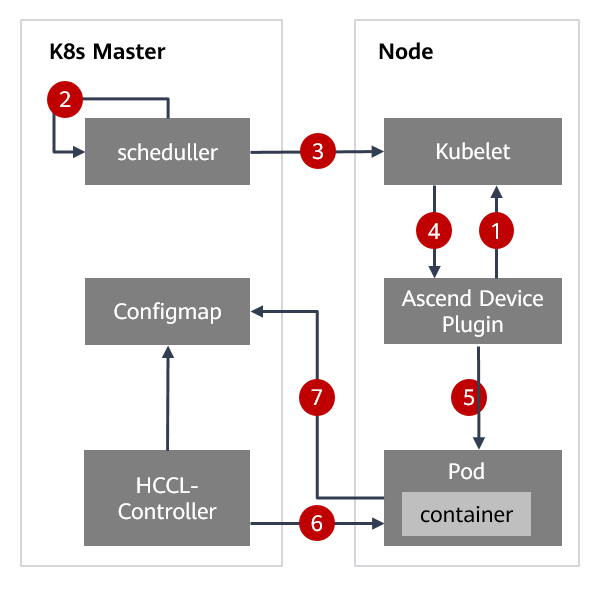

# hccl-controller.zh
-   [Controller介绍](#Controller介绍.md)
-   [HCCL-Controller](#HCCL-Controller.md)
-   [环境依赖](#环境依赖.md)
-   [目录结构](#目录结构.md)
-   [版本更新信息](#版本更新信息.md)
<h2 id="Controller介绍.md">Controller介绍</h2>

-   一个Controller至少追踪一种类型的Kubernetes资源。这些对象有一个代表期望状态的指定字段。Controller负责确保其追踪的资源对象的当前状态接近期望状态。
-   Controller Manager就是集群内部的管理控制中心，由负责不同资源的多个Controller构成，共同负责集群内的节点、Pod等所有资源的管理。
-   Controller Manager主要提供了一个分发事件的能力，而不同的Controller只需要注册对应的Handler来等待接收和处理事件。
-   每种特定资源都有特定的Controller维护管理以保持预期状态。

**图 1**  Controller interaction process<a name="fig14783175555117"></a>  


<h2 id="HCCL-Controller.md">HCCL-Controller</h2>

## HCCL-Controller整体流程<a name="section2078393613277"></a>
HCCL-Controller 是华为自研的一款用于NPU训练任务的组件，利用kubernetes的informer机制，持续监控NPU训练任务及其POD的各种事件，并读取POD的NPU信息，生成对应的
Configmap。该Configmap包含了NPU训练任务需要的hccl.json配置文件，方便NPU训练任务更好的协同和调度底层的昇腾处理器。
HCCL-Controller整体流程如[图1](#fig13227145124720)所示。

**图 1**  HCCL-Controller process<a name="fig13227145124720"></a>  


1.  Device-plugin通过list-and-watch接口，定时上报节点昇腾910处理器DeviceID和健康状态。

2.  Scheduller收到用户训练任务请求，创建Job和Configmap。使用Volacno调度器选择Job部署的节点。

3.  Scheduller发送创建Pod信息到选中的节点Kubelet上。

4.  在被选择的节点上，Device-plugin会从Kubelet收到分配设备的请求，返回DeviceID、Volume、环境变量等信息给Kubelet，Kubelet分配资源给Pod。

5.  Device-plugin修改该Pod的annotation字段，将分配给Pod的昇腾910处理器网卡IP和DeviceID写入Pod的annotation。

6.  HCCL-Controller持续监控volcano job和Pod的变化，如果有新创建的Pod，HCCL-Controller会把Pod中annotation值取出，当volcano job的所有Pod信息获取完后，更新对应rings-config的Configmap。

7.  Pod中容器训练任务持续查看Configmap的状态，发现状态为完成后，则可以从configmap中生成hccl.json文件


## HCCL-Controller业务规则<a name="section139091513611"></a>

HCCL-Controller是专门用于生成训练作业所有Pod的hccl.json文件的组件，该组件为Atlas 800 训练服务器K8s集群专用组件。

-   <a name="li121021418717"></a>训练任务，Pod，ConfigMap需要设置ring-controller.atlas: ascend-910标签，HCCL-Controller通过该标签过滤，用于区分昇腾910场景和非昇腾910场景。
-   volcano job与configmap的对应方式：volcano job.yaml中volume（ascend-910-config）的configmap name，就是volcano job对应的configmap。
-   hccl-controller持续监控 volcano job，pod和ConfigMap的变化（需携带[•约定1：训练任务，Pod，ConfigMap需...](#li121021418717)中的标签），同一个训练任务的volcano job和ConfigMap通过volume（ascend-910-config）关联。如果有新创建的Pod，hccl-controller把Pod中的annotation（atlas.kubectl.kubernetes.io/ascend-910-configuration）的值取出，为volcano job创建数据缓存信息表，当volcano job的所有实例信息获取完整后，更新对应的rings-config的ConfigMap。
-   ConfigMap中rings-config的文件名默认为hccl.json，默认挂在路径为：“/user/serverid/devindex/config”。

## 部署HCCL-Controller<a name="section124015514383"></a>

1.  编译HCCL-controller
    ```
        cd build
        chmod +x build.sh
        ./build.sh
    ```

2.  执行以下命令，启动HCCL-Controller。
    ```
        mkdir -p /var/log/atlas_dls/hccl-controller
        kubectl apply -f rbac.yaml
        kubectl apply -f hccl-controller.yaml
    ```
    


<h2 id="环境依赖.md">环境依赖</h2>

Kubernetes 1.16及以上

Go 1.13及以上

<h2 id="目录结构.md">目录结构</h2>

```
hccl-controller                                               #深度学习组件hccl-controller模块                       
├── build                                                  #编译和测试目录 
│   ├── build.sh
│   ├── Dockerfile
│   ├── hccl-controller.yaml
│   ├── rbac.yaml
│   ├── test.bat
│   └── test.sh
├── doc
│   └── images                                             #文档素材
│       ├── Controller-interaction-process.png
│       ├── HCCL-Controller-process.png
│       ├── icon-caution.gif
│       ├── icon-danger.gif
│       ├── icon-note.gif
│       ├── icon-notice.gif
│       ├── icon-tip.gif
│       └── icon-warning.gif
├── go.mod
├── go.sum
├── hack
│   ├── update-codegen.sh
│   └── verify-codegen.sh
├── main.go                                                  #程序入口
├── mindx-dl                                                 #mindx dl组件文档及安装脚本
│   ├── check_env                                           #环境检查脚本
│   │   ├── check_env.sh
│   │   └── check_env.yaml
│   ├── collect_log                                         #日志收集脚本
│   │   ├── collect_log.py
│   │   └── collect_log.yaml
│   ├── deploy                                              #mindx dl安装脚本
│   │   ├── offline                                        #离线安装脚本
│   │   │   ├── offline_join_cluster.yaml
│   │   │   └── steps
│   │   │       ├── clean_services.yaml
│   │   │       ├── entry.sh
│   │   │       ├── init_kubernetes.yaml
│   │   │       ├── offline_deploy_service.yaml
│   │   │       ├── offline_install_packages.yaml
│   │   │       ├── offline_load_images.yaml
│   │   │       └── set_global_env.yaml
│   │   └── online                                         #在线安装脚本
│   │       ├── online_join_cluster.yaml
│   │       └── steps
│   │           ├── clean_services.yaml
│   │           ├── entry.sh
│   │           ├── init_kubernetes.yaml
│   │           ├── online_deploy_service.yaml
│   │           ├── online_install_packages.yaml
│   │           ├── online_load_images.yaml
│   │           └── set_global_env.yaml
│   ├── LICENSE
│   ├── README_EN.md
│   ├── README.md
│   ├── Third\ Party\ Open\ Source\ Software\ Notice.md
│   ├── uninstall                                            #卸载脚本
│   │   ├── entry.sh
│   │   └── uninstall.yaml
│   ├── upgrade                                              #升级脚本
│   │   ├── entry.sh
│   │   ├── upgrade.yaml
│   │   └── volcano-difference
│   │       ├── gen-admission-secret.sh
│   │       └── volcano-v0.4.0-r03.yaml
│   └── yamls                                                #各组件部署文件
│       ├── ascendplugin-310-v20.2.0.yaml
│       ├── ascendplugin-volcano-v20.2.0.yaml
│       ├── cadvisor-v0.34.0-r40.yaml
│       ├── calico.yaml
│       ├── hccl-controller-v20.2.0.yaml
│       └── volcano-v1.0.1-r40.yaml
├── output                                                    #编译结果输出路径
│   └── README.md
├── pkg                                                       #程序文件包
│   ├── apis
│   │   └── resourcecontroller
│   │       ├── register.go
│   │       └── v1alpha1
│   │           ├── doc.go
│   │           ├── register.go
│   │           ├── types.go
│   │           └── zz_generated.deepcopy.go
│   ├── resource-controller
│   │   └── signals
│   │       ├── signal.go
│   │       ├── signal_posix.go
│   │       └── signal_windows.go
│   └── ring-controller
│       └── controller
│           ├── agent_interface.go
│           ├── businessagent.go
│           ├── businessagent_test.go
│           ├── businessworker.go
│           ├── businessworker_test.go
│           ├── controller.go
│           ├── controller_test.go
│           └── type.go
├── README_EN.md                                           #HCCL-Controller README文件英文版
└── README.md                                              #HCCL-Controller README文件中文版
```

<h2 id="版本更新信息.md">版本更新信息</h2>


| 版本   | 发布日期   | 修改说明  |
| ---- | ---- | ---- |
| v20.2.0| 2020-12-30    | 更新目录结构章节    |
| v20.1.0| 2020-09-30    | 第一次正式发布    |

