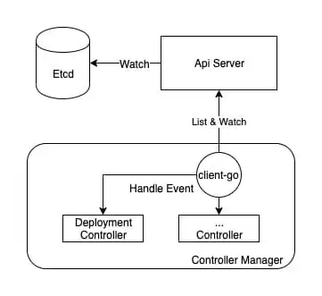
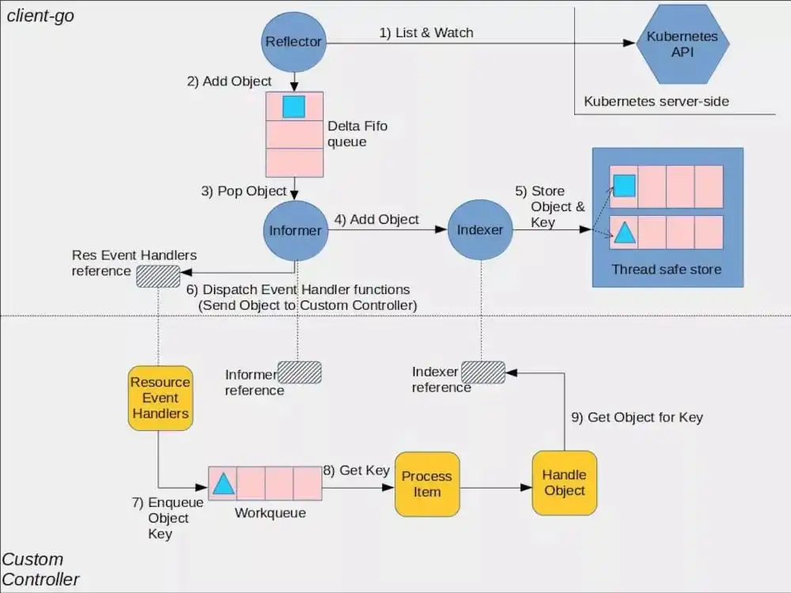
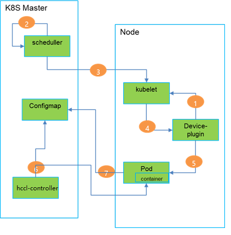

# hccl-controller 使用说明
hccl-controller 是深度学习平台的组件，它通过和Ascned Volcano、Ascend Device Plugin、Ascend-kubelet等联动，来动态生成ranktable文件，该文件涉及训练任务所需的芯片Device ID、Device IP等配置，详细内容见附录1。

## 1 controller 的功能架构
### 1.1  [controller 介绍](https://kubernetes.io/zh/docs/concepts/architecture/controller/)
1. 一个controller至少追踪一种类型的 Kubernetes 资源。这些对象有一个代表期望状态的指定字段。controller负责确保其追踪的资源对象的当前状态接近期望状态。

2. Controller Manager就是集群内部的管理控制中心，由负责不同资源的多个Controller构成，共同负责集群内的 Node、Pod等所有资源的管理。

3. Controller Manager主要提供了一个分发事件的能力，而不同的Controller只需要注册对应的 Handler来等待接收和处理事件。

4. 每种特定资源都有特定的Controller维护管理以保持预期状态。

   

### 1.2 controller 流程架构
controller利用List接口从API Server中获取资源对象的全量数据并存储在缓存中，之后再利用Watch接口对API Server进行监听并且以增量事件的方式持续接收资源对象的变更。一方面Controller可以对这些资源对象的增量变更事件进行即时处理，另一方面，也可对缓存进行更新，保证缓存与API Server中的源数据保持最终的一致性。



上图中有一条虚线体贴地将整张架构图切割为成了两部分：图的上半部分是client-go封装的与API Server的底层交互逻辑；下半部分则是Controller的业务代码，主要是针对资源对象增量事件的处理。
## 2 hccl-controller 的整体流程
hccl-controller 整体流程如下图所示。



1. Device-plugin通过list-and-watch接口，定时上报node节点A910 device ID和健康状态。
2. Scheduller收到用户训练任务请求，创建Job和configmap。使用volacno调度器选择Job部署的node节点。
3. Scheduller发送创建Pod信息到选中的node节点的kubelet上。
4. 被选择的node节点上，Device-plugin会从kubelet收到分配设备的请求，返回DeviceID、Volume、环境变量等信息。Kubelet创建Pod。
5. Device-plugin修改该Pod的annotation字段，分配给Pod的芯片设备ROCE网卡IP和A910 ID写入POD的annotation。
6. hccl-controller持续监控volcano job（Pod)对象的变化，如果有新Pod创建，hccl-controller把Pod中annotation的值取出，当volcano job的所有Pod信息获取完整后，更新对应的rings-config的configmap。
7. Pod中容器训练任务持续查看configmap的状态，发现状态为完成后，则可以从configmap中生成ranktable文件
## 3 hccl-controller 的业务约定规则
hccl-controller是专门用于生成训练作业所有POD的Ranktable文件的组件，以插件方式运行在A800集群中，该插件为A800集群专用插件。
1. 约定1：知名标签(如：ring-controller.atlas: ascend-910)，训练任务，POD，ConfigMap对象需要设置知名标签，hccl-controller通过该标签过滤，用于区分910场景和非910场景的对象。
2. 约定2:知名volume(ascend-910-config)，volcano job与configmap的对应方式：volcano job中的volume(ascend-910-config)中的configmap name，就是volcano job对应的configmap。
3. 约定3:ring-controller持续watch volcano job，pod和configmap对象的变化(携带知名标签)，同一个训练任务的volcano job和configmap通过volume(ascend-910-config)关联。如果有新pod创建，hccl-controller把pod中的annotation(atlas.kubectl.kubernetes.io/ascend-910-configuration)的值取出，为volcano job创建数据缓存信息表，当volcano job的所有实例信息获取完整后，更新对应的rings-config的configmap。
4. 约定4：configmap中rings-config的文件名默认为hccl.json，默认挂在路径为：/user/serverid/devindex/config。

## 4 hccl-controller 的部署yaml和使用volcano的yaml介绍
### 4.1 部署hccl的yaml介绍

部署使用[deplyment](https://kubernetes.io/zh/docs/concepts/cluster-administration/manage-deployment/)的部署方式，如下yaml
hccl-controller.yaml
``` yaml
apiVersion: apps/v1
kind: Deployment
metadata:
  name: hccl-controller
spec:
  replicas: 1
  selector:
    matchLabels:
      app: hccl-controller
  template:
    metadata:
      labels:
        app: hccl-controller
    spec:
      containers:
      - name: hccl-controller
        image: hccl-controller:latest
        imagePullPolicy: Never
        command: [ "/bin/bash", "-c", "--"]
        args: [ "hccl-controller --logtostderr=false --log_dir=/var/log/hccl-controller
         --log_file=/var/log/hccl-controller/hccl-controller.log  --stderrthreshold=1 -v=5" ]
        volumeMounts:
          - name: device-hcclcontroller
            mountPath: /var/log
      volumes:
        - name: device-hcclcontroller
          hostPath:
            path: /var/log
```
### 4.2 使用volcano yaml
job.yaml
```yaml
apiVersion: v1
kind: ConfigMap
metadata:
  name: rings-config-resnet1-1
  namespace: kube-system
  labels:
    ring-controller.atlas: ascend-910
data:
  hccl.json: |
    {
        "status":"initializing"
    }
---
apiVersion: batch.volcano.sh/v1alpha1
kind: Job
metadata:
  name: resnet1-1
  namespace: kube-system
  labels:
    ring-controller.atlas: ascend-910
spec:
  minAvailable: 1
  schedulerName: volcano
  policies:
    - event: PodEvicted
      action: RestartJob
  plugins:
    ssh: []
    env: []
    svc: []
  maxRetry: 3
  queue: default
  tasks:
  - name: "default-test"
    replicas: 1
    template:
      metadata:
        labels:
          app: tf
          ring-controller.atlas: ascend-910
      spec:
        containers:
        - image: ubuntu18.04:c72b020
          imagePullPolicy: IfNotPresent
          name: tf
		command:
          - "/bin/bash"
          - "-c"
          - "./datanfs/train_start.sh"
          resources:
            requests:
              huawei.com/Ascend910: 1
            limits:
              huawei.com/Ascend910: 1
          volumeMounts:
          - name: ascend-910-config
            mountPath: /user/serverid/devindex/config
          - name: nfs
            mountPath: /datanfs
        volumes:
        - name: ascend-910-config
          configMap:
           name: rings-config-resnet1-1
        - name: nfs
          nfs:
            server: 192.168.0.1
            path: "/data/k8s/resnet50-test"
        env:
        - name: resnet
          valueFrom:
            fieldRef:
              fieldPath: metadata.name
        restartPolicy: OnFailure

```

## 5 启动hccl-controller
### 5.1 创建hccl-controller的日志文件
```shell
mkdir -p /var/log/hccl-controller
```
### 5.2 启动hccl-controller
```shell
kubectl apply -f hccl-controller.yaml
```
### 5.2 启动任务
```shell
kubctl apply -f job.yaml
```
## 附录1  hccl-controller 生成ranktable文件介绍
### 内容样式如下
```json
{
    "status": "completed", 
    "group_count": "2", 
    "group_list": [
        {
            "group_name": "", 
            "instance_count": "2", 
            "instance_list": [
                {
                    "pod_name": "tf-bae43", 
                    "server_id": "10.0.0.10", 
                    "devices": [
                        {
                            "device_id": "0", 
                            "device_ip": "192.168.0.11"
                        }, 
                        {
                            "device_id": "1", 
                            "device_ip": "192.168.0.12"
                        }
                    ]
                }, 
                {
                    "pod_name": "tf-ze9o", 
                    "server_id": "10.0.0.11", 
                    "devices": [
                        {
                            "device_id": "6", 
                            "device_ip": "192.168.0.25"
                        }, 
                        {
                            "device_id": "7", 
                            "device_ip": "192.168.0.26"
                        }
                    ]
                }
            ]
        }
    ]
}
```
### 字段描述
|  字段    | 描述     |
| ---- | ---- |
|   status   |  Initializing:configmap创建初始值，容器内jobstart_hccl.json不可读取 completed:Ring信息补充完整时填写该状态，容器内jobstart_hccl.json可以读取|
|   Group数组   | 数组成员总数为job中task的个数     |
|  group_name    |  Jobtask的Name，如果没有task或者task个数为1，group_name 可以为空字符串(””)    |
|  instance数组    |  数组成员总数为job中task的replica个数    |
|   Pod_name   |  POD Name    |
|  Server_id    |   Node Name或者Node IP   |
|  Devices数组    | 数组成员总数为POD挂载910个数     |
|   device_id   |  910的设备ID    |
|   device_ip   |  910的设备的ROCE IP地址    |

